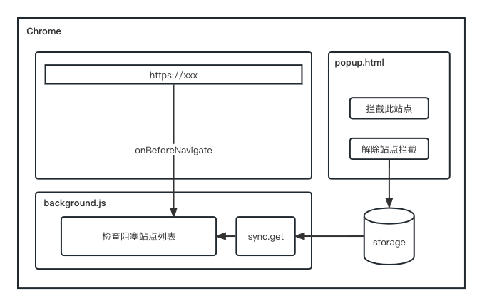

## StayFocus：阻止网站并保持专注

StayFocus 是一款免费的 Chrome 扩展，用于替代收费版的 BlockSite，支持自定义阻塞站点，在工作和学习中保持专注并提高生产力。

**Features：**

- 支持自定义网页阻止列表
- 使用 chrome.storage API 存储，随 Google 账号同步
- 即将发布 chrome 应用商店-免费使用

### License

This project is licensed under the [Apache 2.0 license](https://github.com/ZuoFuhong/StayFocus/blob/master/LICENSE).